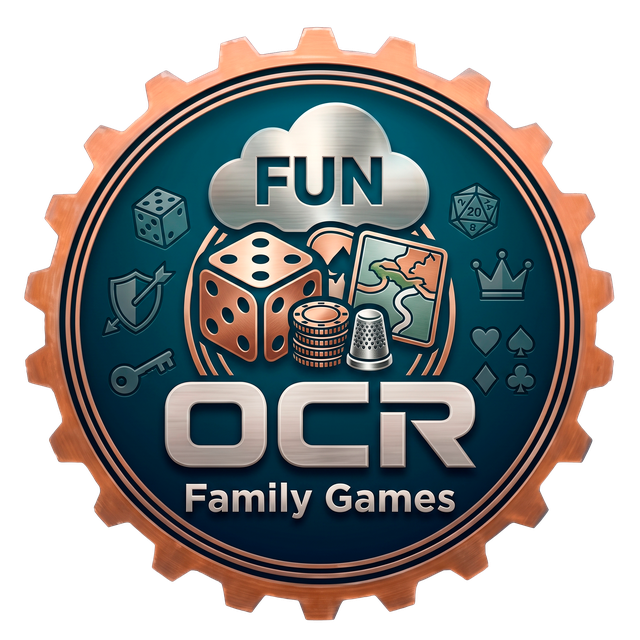

  

<h1 align="center">OCR Family Games</h1>

<strong>Doce juegos de siempre para tablet y teléfono. 
Sin anuncios. Sin cuentas. Sin prisa.</strong>

---

## Por qué existe

Esta aplicación nació por una razón muy concreta: mis padres juegan al solitario y a los
juegos de palabras en la tablet, y **casi todo lo que hay en el Play Store para eso está
plagado de anuncios**. No anuncios discretos: pantallas completas entre partida y partida,
vídeos que no se pueden cerrar, y —esto es lo grave— avisos falsos de que el teléfono
«tiene virus» que llevan a instalar un antivirus que luego cobra por arreglar problemas
que no existen.

Una persona mayor no tiene por qué distinguir eso de la propia aplicación. Así que en vez
de enseñarles a esquivar trampas, hicimos una aplicación que no las tiene.

## Los juegos

**Cartas**

| Juego | De qué va |
|---|---|
| **Solitario** | El Klondike de toda la vida. Se puede jugar levantando las cartas de una en una (casi todas las partidas salen) o de tres en tres, el clásico. |
| **Carta Blanca** | El FreeCell. Las 52 cartas a la vista desde el principio y cuatro huecos libres. Casi siempre tiene solución. |
| **Araña** | Con uno, dos o cuatro palos. Con un solo palo se entiende a la primera; con cuatro es de los solitarios más difíciles que existen. |
| **La Pirámide** | Quitar parejas que sumen 13 hasta deshacer la pirámide. Partidas cortas. |
| **Parejas** | Encontrar las parejas de dibujos iguales. Reglas de una frase y no se pierde nunca. |

**Palabras**

| Juego | De qué va |
|---|---|
| **Palabras** | Tablero de 15×15 contra la máquina, con tres niveles. Diccionario de 635.090 palabras. |
| **Crucigrama** | Unir las letras de un círculo para ir rellenando un crucigrama, al estilo de los juegos de palabras que se llevan ahora. |
| **Sopa de letras** | Diez temas: frutas, animales, oficios, provincias, flores… |
| **Ahorcado** | Adivinar la palabra letra a letra. Siempre se dice de qué tema es. |

**Números y lógica**

| Juego | De qué va |
|---|---|
| **Sudoku** | Tres niveles, con solución única garantizada, lápiz para anotar y pistas sin límite. |
| **Buscaminas** | Tres tamaños. La primera casilla nunca es una mina. |
| **2048** | Juntar números iguales. Se juega deslizando o con flechas grandes, para quien no arrastre bien. |

## Qué **no** hace esta aplicación

- **No tiene anuncios** de ningún tipo. Ni banners, ni pantallas entre partidas, ni vídeos.
- **No pide dinero** por nada. No hay compras dentro de la aplicación.
- **No pide cuenta**, ni correo, ni número de teléfono.
- **No recoge datos de uso** ni los envía a ninguna parte.
- **No avisa nunca de virus** ni de problemas del teléfono.

### La única conexión que hace

Para jugar no hace falta internet: **los doce juegos funcionan con el aparato
desconectado**. La aplicación solo se conecta a `api.github.com`, y solo para mirar si hay
una versión nueva y, si usted acepta, descargarla. Ese aviso se puede apagar en Ajustes.

No hay ningún SDK de publicidad ni de analítica entre las dependencias. Se puede
comprobar: el manifiesto declara `INTERNET`, `ACCESS_NETWORK_STATE`,
`REQUEST_INSTALL_PACKAGES` (para instalar la actualización) y `VIBRATE`. Nada más.

Las partidas a medias y las marcas personales se guardan **únicamente dentro del aparato**.

## Pensada para quien le cuesta la pantalla

No es una aplicación normal a la que se le ha subido el tamaño de letra. Las decisiones
vienen de ahí:

- **El tamaño de la letra se elige dentro de la aplicación** (Normal, Grande, Muy grande),
  no solo en los ajustes de Android, porque mucha gente mayor no los ha tocado nunca.
  Arranca en «Grande».
- **Contraste alto**, con un modo de blanco y negro puros para la pantalla al sol. No usa
  los colores automáticos de Android: el tono que elige el móvil puede salir lavado.
- **Nada pulsable mide menos de 60dp**, y los botones principales llevan texto además de
  icono.
- **Se juega tocando, no arrastrando.** En los solitarios se toca la carta y se toca dónde
  dejarla; tocarla dos veces la manda sola al mejor sitio. En la sopa de letras y en el
  crucigrama se puede arrastrar o ir tocando, lo que resulte más cómodo.
- **Ningún juego tiene cuenta atrás** ni castiga por tardar.
- **Todos tienen «Ayuda»** siempre a la vista, escrita en lenguaje llano.
- **Las partidas a medias se recuperan solas.** Si suena el teléfono, al volver está todo
  donde estaba.

## Instalación

Hace falta **Android 8 o posterior**.

1. Descargue el APK de la [última versión](../../releases/latest).
2. Ábralo desde Archivos o desde las notificaciones de descarga.
3. Android pedirá permiso para instalar de «orígenes desconocidos» la primera vez. Es
   normal: la aplicación no está en el Play Store.

Después se actualiza sola: al abrirla avisa si hay una versión nueva y la instala con un
par de toques.

## Sobre el rival del juego de Palabras

**No es inteligencia artificial.** Es una búsqueda exhaustiva sobre el diccionario con
reglas fijas (el algoritmo de Appel y Jacobson, de 1988): ante el mismo tablero y las
mismas fichas encuentra siempre exactamente las mismas jugadas. No aprende, no se conecta
a ningún sitio y no manda nada a ninguna parte.

Por eso no le aplica el artículo 50 del Reglamento (UE) 2024/1689.

## Créditos y licencias de los datos

- Diccionario de español: [`an-array-of-spanish-words`](https://github.com/words/an-array-of-spanish-words),
  licencia MIT, derivado a su vez de la lista de Letterpress. En la aplicación va
  empaquetado como autómata (DAWG): 635.090 palabras en 0,51 MB.
- Palabras del Crucigrama, elegidas por frecuencia de uso:
  [`hermitdave/FrequencyWords`](https://github.com/hermitdave/FrequencyWords), licencia MIT.

Desarrollado con asistencia de Claude (Anthropic).

---

OCR IT Support

